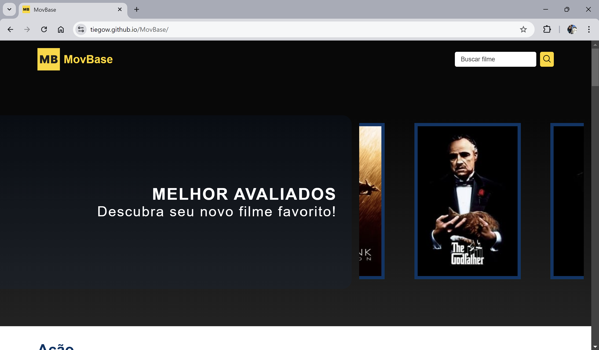
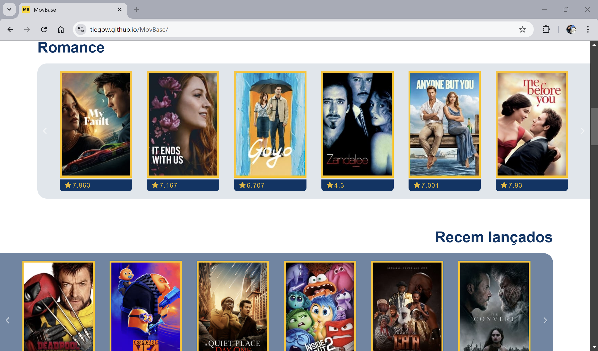
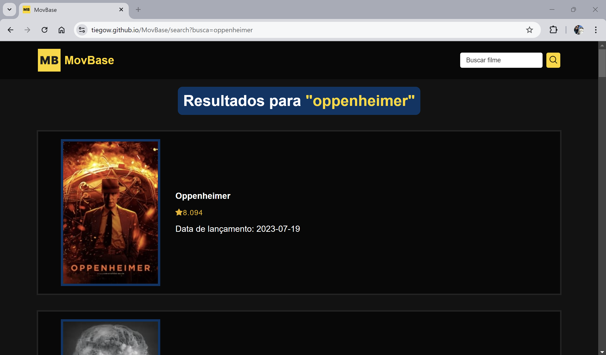

    <h1>MovBase</h1>
    
    <h3>Base de dados de filmes</h3>

# Sobre o site

    
    
Página inicial do MovBase

MovBase fornece dados sobre diversos filmes dos cinemas e streaming, desde os novos lançamentos até os amados clássicos do cinema. O site foi implementado usando **Angular 18**, e faz uso da **The Movie Database (TMDB)**, uma base de dados para filmes e séries.

- Source e componentes em <a href="https://github.com/Tiegow/MovBase/tree/src/src">src</a>
- Build do projeto em <a href="https://github.com/Tiegow/MovBase/tree/gh-pages">gh-pages</a>

# Features
### Listagem de filmes por suas classificações e gêneros

    

### Buscar por filmes que você conhece

    

### Obter informações úteis sobre os filmes

    

## Acessar
O projeto está atualmente hospedado com o github pages. 

Acesse <a href="https://tiegow.github.io/MovBase/">aqui</a>
